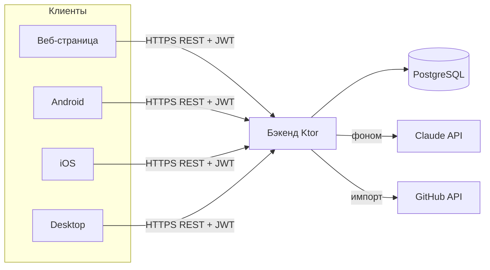

# DevLog — архитектура

## Общая модель
Клиент-сервер. **Сервер — единственный источник правды** (данные, бизнес-логика, ИИ).
Клиенты тонкие: показывают данные и шлют запросы. Так несколько клиентов (веб, Android,
iOS, десктоп) работают с одними данными и остаются согласованными.

## Бэкенд
- **Ktor** — веб-фреймворк на Kotlin (уже знаком по Expenses).
- **PostgreSQL** — база данных; доступ через **Exposed** (Kotlin-обёртка над SQL) и
  **HikariCP** (пул соединений — переиспользует открытые подключения к БД).
- **REST API** — набор HTTP-«ручек» `/api/...` (перечень ниже). GraphQL пока не берём.
- **Фоновая обработка ИИ:** запрос к ИИ идёт секунды, поэтому запись сохраняем сразу
  как «сырую» со статусом `queued`, а структурирование выполняем в фоне (корутина/очередь).
  Клиент показывает «обрабатывается…» и подтягивает результат позже.

## Слой ИИ
- Провайдер — **Claude API** (Anthropic). Ключ хранится **только на сервере**, клиенты
  в ИИ напрямую не ходят (иначе ключ утечёт и любой сможет тратить деньги).
- **Структурированный вывод:** просим у модели строгий JSON по схеме (суть/шаги/решения/
  проблемы/итог/теги) через механизм «tool use», а не свободный текст — так результат
  надёжно кладётся в БД.
- **Контроль стоимости с первого дня:** лимит запросов на пользователя, батчинг (день
  пачкой), кэш. Модель структурирования и модель генерации отчёта можно выбрать разные.
- **Приватность:** явное предупреждение, что текст уходит в ИИ; выключатель ИИ на уровне
  проекта (`ai_enabled`); содержимое записей не пишем в открытые логи.

## Клиенты
- **Kotlin Multiplatform (KMP)** — один код на Kotlin компилируется под Android/iOS/Desktop.
  **Compose Multiplatform** — тот же Jetpack Compose (знаком по SkyCast/DiceRoller), но
  работающий на всех трёх. UI пишется почти один раз.
- **Общий модуль (shared):** модели данных, сетевой слой (**Ktor Client** — уже писал
  для Telegram-бота), локальная БД (**SQLDelight** для офлайна), бизнес-логика.
- **Веб на старте — HTML-страница, которую отдаёт сам бэкенд** (как в Expenses).
  «Настоящий» веб на Compose/Wasm или отдельном фронтенде — позже (Wasm ещё сыроват).

## Данные, офлайн, синхронизация
- Сервер — источник правды (PostgreSQL). Клиенты кэшируют локально (SQLDelight).
- Синхронизация: у записей UUID + `updated_at`, конфликты — «последняя запись побеждает»,
  идемпотентность против дублей. (Проектировалось так же в Expenses.)

## Авторизация и безопасность
- **JWT** (JSON Web Token — самодостаточный токен-пропуск): клиент логинится, получает
  токен, шлёт его в заголовке каждого запроса.
- Пароли — хеш (bcrypt/argon2), в открытом виде не храним.
- **Изоляция пользователей (multi-tenant):** каждый запрос ограничен `user_id` из токена;
  чужие данные недоступны в принципе.
- Рабочие данные конфиденциальны → выключатель ИИ по проектам, аккуратные логи, бэкапы `.gpg`.

## Инфраструктура
- Docker + docker-compose: `postgres`, `backend`, `caddy`.
- Сервер брата, зона `/root/app/lev/devlog`, порт из 34000–35000, HTTPS через Caddy +
  DuckDNS-поддомен. Runbook переиспользуется из Expenses.
- CI/CD на GitHub Actions (сборка + тесты).

## Контракт REST API (черновик Фазы 1)
Все `/api/*`, кроме auth и публичного просмотра отчёта, требуют JWT.

**Авторизация**
- `POST /api/auth/register` `{email, password, displayName}` → `{token}`
- `POST /api/auth/login` `{email, password}` → `{token}`
- `GET  /api/me` → `{id, email, displayName}`

**Записи**
- `GET    /api/entries?from=&to=&projectId=` → список записей
- `POST   /api/entries` `{projectId?, occurredOn, rawText, source?, timeSpentMin?}`
  → запись (status=`queued`, ИИ обработает в фоне)
- `GET    /api/entries/{id}` → запись + структурированная часть
- `PUT    /api/entries/{id}` → правка сырого текста/метаданных
- `DELETE /api/entries/{id}`
- `POST   /api/entries/{id}/reprocess` → перезапустить ИИ

**Проекты**
- `GET/POST/PUT/DELETE /api/projects`

**Отчёты**
- `POST /api/reports` `{projectId?, periodStart, periodEnd, format}` → отчёт (ИИ собирает)
- `GET  /api/reports`, `GET /api/reports/{id}`
- `POST /api/reports/{id}/share` → `{shareUrl}`
- `GET  /r/{shareToken}` → публичная HTML-страница отчёта (без авторизации)

**Служебное**
- `GET /health` → `{"status":"ok"}`
