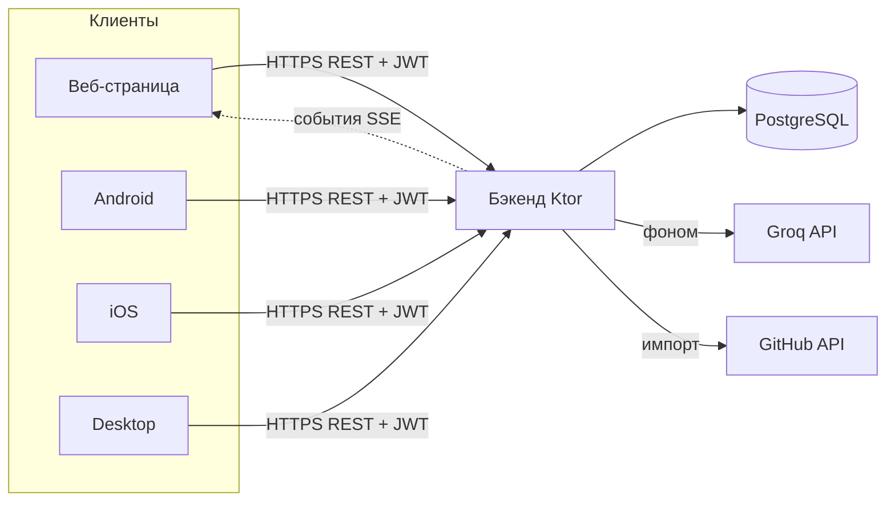

# DevLog — архитектура

## Общая модель
Клиент-сервер. **Сервер — единственный источник правды** (данные, бизнес-логика, ИИ).
Клиенты тонкие: показывают данные и шлют запросы. Так несколько клиентов (веб, Android,
iOS, десктоп) работают с одними данными и остаются согласованными.

## Бэкенд
- **Ktor** — веб-фреймворк на Kotlin (уже знаком по Expenses).
- **PostgreSQL** — база данных; доступ через **Exposed** (Kotlin-обёртка над SQL) и
  **HikariCP** (пул соединений — переиспользует открытые подключения к БД).
- **REST API** — набор HTTP-«ручек» `/api/...` (перечень ниже). GraphQL пока не берём.
- **Схема БД** — миграции Flyway (`resources/db/migration/V…__.sql`), см. `data-model.md`.
- **Фоновая обработка ИИ:** запрос к ИИ идёт секунды, поэтому запись сохраняем сразу
  как «сырую» со статусом `queued`, а структурирование выполняет фоновый воркер.
  Клиент показывает «обрабатывается…», а о готовности узнаёт из события (см. ниже).

### Живые обновления вместо опроса (SSE)
Сначала браузер спрашивал сервер каждые 4 секунды: «уже готово?». Это лишние запросы
и задержка до нескольких секунд. Теперь клиент держит **одно открытое соединение**
(`GET /api/events`, механизм Server-Sent Events), и сервер сам присылает событие
`entry`, когда воркер дообработал запись. Поток односторонний (сервер → клиент),
поэтому WebSocket не нужен.

- События раздаёт `EntryEventBus` — по потоку на пользователя, **в памяти процесса**.
  Терять их не страшно: сама очередь обработки лежит в базе, а клиент при подключении
  всё равно перечитывает ленту. Если серверов станет несколько, сюда добавится общая
  шина (например, LISTEN/NOTIFY у PostgreSQL).
- **Токен для SSE — в cookie, а не в адресе.** Браузерный `EventSource` не умеет слать
  заголовок `Authorization`, а токен в адресной строке попал бы в логи прокси. Поэтому
  страница кладёт его в cookie `devlog_sse` с `path=/api/events` — она уходит только
  на эту ручку.
- Раз в 25 секунд сервер шлёт пустое событие `ping`: молчащие соединения рвут прокси.
- Если соединение не поднялось (старый браузер, прокси режет SSE), клиент возвращается
  к прежнему опросу раз в 4 секунды.

### Очередь обработки ИИ (AiWorker)
**Очередь хранится в базе, а не в памяти процесса.** Это ключевое решение: раньше сервер
запускал корутину «обработай запись» и забывал про неё, поэтому перезапуск сервера
(редеплой, падение) навсегда подвешивал записи в статусе `queued`/`processing`.

Как работает сейчас:
1. Запись сохраняется со статусом `queued` — это и есть «стоит в очереди».
2. `AiWorker` в цикле спрашивает базу: что не обработано? Берёт запись **атомарно** —
   помечает `processing` с условием «статус и число попыток всё ещё те, что я видел».
   Если условие не сошлось, запись успел забрать другой воркер, и мы просто берём следующую
   (заранее готово к нескольким инстансам сервера).
3. Успех → `structured`. Ошибка → текст ошибки в колонку `ai_error`, счётчик `ai_attempts`,
   возврат в очередь; после 3 неудач — окончательный `failed`, и пользователь **видит причину**.
4. Записи, застрявшие в `processing` дольше 5 минут, считаются оборванными (сервер
   перезапустили посреди обработки) и подбираются заново — по колонке `ai_started_at`.
5. Упёрлись в суточный лимит пользователя → запись возвращается в очередь без траты попытки,
   а пользователь до конца суток пропускается (иначе воркер крутился бы на нём вхолостую).

## Слой ИИ
- Провайдер — **Groq** (OpenAI-совместимый API, модель `openai/gpt-oss-20b`); изначально
  планировался Claude API, заменён ради бесплатности на старте. Ключ хранится **только
  на сервере**, клиенты в ИИ напрямую не ходят (иначе ключ утечёт и любой сможет тратить
  деньги).
- **Структурированный вывод:** просим у модели строгий JSON по схеме (суть/шаги/решения/
  проблемы/итог/теги) через механизм «tool use», а не свободный текст — так результат
  надёжно кладётся в БД.
- **Контроль стоимости с первого дня:** лимит запросов на пользователя, батчинг (день
  пачкой), кэш. Модель структурирования и модель генерации отчёта можно выбрать разные.
- **Приватность:** явное предупреждение, что текст уходит в ИИ; выключатель ИИ на уровне
  проекта (`ai_enabled`); содержимое записей не пишем в открытые логи.

## Клиенты
- **Kotlin Multiplatform (KMP)** — один код на Kotlin компилируется под Android/iOS/Desktop.
  **Compose Multiplatform** — тот же Jetpack Compose (знаком по SkyCast/DiceRoller), но
  работающий на всех трёх. UI пишется почти один раз.
- **Общий модуль (shared):** модели данных, сетевой слой (**Ktor Client** — уже писал
  для Telegram-бота), локальная БД (**SQLDelight** для офлайна), бизнес-логика.
- **Веб на старте — HTML-страница, которую отдаёт сам бэкенд** (как в Expenses).
  «Настоящий» веб на Compose/Wasm или отдельном фронтенде — позже (Wasm ещё сыроват).

## Данные, офлайн, синхронизация
- Сервер — источник правды (PostgreSQL). Клиенты кэшируют локально (SQLDelight).
- **Что изменилось после момента X:** `GET /api/entries/changes?since=…` отдаёт записи
  по возрастанию `updated_at` порциями. Клиент запоминает `serverTime` из ответа и в
  следующий раз присылает его как `since` — качать всю ленту заново не нужно.
- **Мягкое удаление.** `DELETE` не стирает строку, а помечает её удалённой (`deleted_at`)
  и вычищает содержимое. Без этого устройство, которое было офлайн, не узнало бы об
  удалении и запись у него «воскресла» бы. В обычной ленте надгробий нет — только
  в синхронизации, с `deleted: true`.
- **Идемпотентное создание.** Клиент может прислать свой `id` (UUID) в `POST /api/entries`.
  Повторная отправка при плохой сети вернёт ту же запись, а не создаст дубль.
- Конфликты правок — «последняя запись побеждает» по `updated_at`.

## Авторизация и безопасность
- **JWT** (JSON Web Token — самодостаточный токен-пропуск): клиент логинится, получает
  токен, шлёт его в заголовке каждого запроса.
- Пароли — хеш (bcrypt/argon2), в открытом виде не храним.
- **Изоляция пользователей (multi-tenant):** каждый запрос ограничен `user_id` из токена;
  чужие данные недоступны в принципе. Ссылки на чужие сущности тоже проверяются:
  привязать запись или отчёт к **чужому проекту** нельзя (иначе можно было обойти его
  выключатель ИИ — для чужого проекта проверка «ИИ разрешён?» отвечала «да»).
- **Отказ старта с небезопасным секретом:** если `JWT_SECRET` не задан, сервер поднимется
  только на localhost. Слушать внешний адрес (в Docker `HOST=0.0.0.0`) с секретом
  из исходников он откажется — иначе кто угодно подписал бы себе токен с чужим `userId`.
- **Проверка входных данных:** кривая дата или id → `400` с понятным текстом, а не `500`.
  Длина заметки ограничена (`MAX_RAW_TEXT_LENGTH` = 20 000 символов) — защита базы
  и лимита обращений к ИИ от вставки на мегабайт.
- Публичная страница отчёта отдаётся с `noindex, nofollow` — секретная ссылка не должна
  попасть в поисковую выдачу.
- Рабочие данные конфиденциальны → выключатель ИИ по проектам, аккуратные логи, бэкапы `.gpg`.

## Инфраструктура
- Docker + docker-compose: `postgres`, `backend`, `caddy`.
- Сервер брата, зона `/root/app/lev/devlog`, порт из 34000–35000, HTTPS через Caddy +
  DuckDNS-поддомен. Runbook переиспользуется из Expenses.
- CI/CD на GitHub Actions (сборка + тесты).

## Контракт REST API (черновик Фазы 1)
Все `/api/*`, кроме auth и публичного просмотра отчёта, требуют JWT.

**Авторизация**
- `POST /api/auth/register` `{email, password, displayName}` → `{token}`
- `POST /api/auth/login` `{email, password}` → `{token}`
- `GET  /api/me` → `{id, email, displayName}`

**Записи**
- `GET    /api/entries?from=&to=&projectId=&q=&tag=` → список записей
  (`q` — поиск по сырому тексту и по структуре от ИИ; `tag` — точное совпадение тега)
- `GET    /api/entries/changes?since=&limit=` → `{entries, serverTime, hasMore}` —
  изменения для синхронизации, включая удалённые (`deleted: true`)
- `POST   /api/entries` `{projectId?, occurredOn, rawText, source?, timeSpentMin?, id?}`
  → запись (status=`queued`, ИИ обработает в фоне). `id` — необязательный UUID от клиента:
  повторная отправка с тем же id не создаст дубль
- `GET    /api/entries/{id}` → запись + структурированная часть
- `PUT    /api/entries/{id}` → правка сырого текста/метаданных
- `DELETE /api/entries/{id}` — мягкое удаление (остаётся надгробие для синхронизации)
- `POST   /api/entries/{id}/reprocess` → перезапустить ИИ

**Проекты**
- `GET/POST/PUT/DELETE /api/projects`

**Отчёты**
- `POST   /api/reports` `{projectId?, periodStart, periodEnd, format}` → отчёт (ИИ собирает)
- `GET    /api/reports`, `GET /api/reports/{id}` — в ответе и `contentMd`, и `contentHtml`
  (готовый HTML рендерит `Markdown.kt` — тот же код, что и публичная страница, без второго
  конвертера на клиенте)
- `PUT    /api/reports/{id}` `{contentMd, title?}` — правка перед отправкой работодателю
- `DELETE /api/reports/{id}`
- `POST   /api/reports/{id}/share` → `{shareToken, url}`
- `DELETE /api/reports/{id}/share` — отозвать публичную ссылку
- `GET    /r/{shareToken}` → публичная HTML-страница отчёта (без авторизации, `noindex`)

**События**
- `GET /api/events` → поток SSE. Токен — в cookie `devlog_sse`. События: `ready`
  (подключились), `entry` (`{entryId, status}` — запись изменилась), `ping` (сигнал жизни),
  `unauthorized` (токена нет или истёк — сервер закрывает поток).

**Статистика**
- `GET /api/stats/activity?from=&to=` → `{days, currentStreak, longestStreak, totalEntries,
  activeDays}` — данные для календаря активности за год и счётчика дней подряд

**Импорт**
- `POST /api/import/github` `{periodStart, periodEnd, projectId?}` →
  `{days, commits, created, skipped}` — тянет публичную активность GitHub
  (`/users/{login}/events/public`, без токена) и складывает коммиты каждого дня
  в одну запись дневника. Повторный импорт того же дня ничего не дублирует:
  id записи вычисляется из пользователя и даты.
  Ограничения источника: только открытые репозитории, ~90 дней, до 300 событий.
- Логин GitHub хранится в профиле (`PUT /api/me {githubLogin}`); **токен не храним** —
  приватные репозитории потребуют его, и тогда появится отдельное хранилище секретов.

**Служебное**
- `GET /health` → `{"status":"ok"}` (открыта, для мониторинга и деплоя)
- `GET /api/config` → `{aiEnabled, aiDailyLimit}` — включён ли ИИ на сервере.
  Нужна интерфейсу: без ключа запись честно висит в очереди, и клиент пишет «ИИ выключен»,
  а не притворяется, что обработка идёт.
